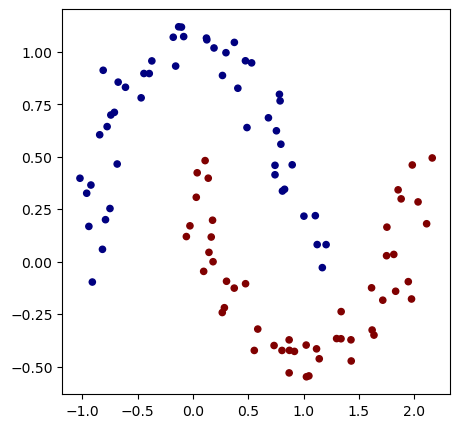
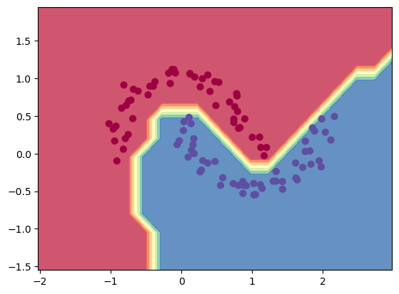

micrograd-nbdev
================

<!-- WARNING: THIS FILE WAS AUTOGENERATED! DO NOT EDIT! -->

This file will become your README and also the index of your
documentation.

## Install

``` sh
pip install micrograd_nbdev
```

## How to use

Fill me in please! Don’t forget code examples:

``` python
np.random.seed(1337)
random.seed(1337)
```

``` python
# make up a dataset
from sklearn.datasets import make_moons, make_blobs
X, y = make_moons(n_samples=100, noise=0.1)
# make y -1 or 1
y = y*2-1
# visualize in 2D
plt.figure(figsize=(5,5))
plt.scatter(X[:,0], X[:,1], c=y, s=20, cmap='jet')
```

    <matplotlib.collections.PathCollection>



``` python
# initialize a model with 2 features
model = MLP(2,[16, 16, 1])
print(model)
print("number of parameters", len(model.parameters()))
```

    MLP of [Layer of [ReLU Neuron(2), ReLU Neuron(2), ReLU Neuron(2), ReLU Neuron(2), ReLU Neuron(2), ReLU Neuron(2), ReLU Neuron(2), ReLU Neuron(2), ReLU Neuron(2), ReLU Neuron(2), ReLU Neuron(2), ReLU Neuron(2), ReLU Neuron(2), ReLU Neuron(2), ReLU Neuron(2), ReLU Neuron(2)], Layer of [ReLU Neuron(16), ReLU Neuron(16), ReLU Neuron(16), ReLU Neuron(16), ReLU Neuron(16), ReLU Neuron(16), ReLU Neuron(16), ReLU Neuron(16), ReLU Neuron(16), ReLU Neuron(16), ReLU Neuron(16), ReLU Neuron(16), ReLU Neuron(16), ReLU Neuron(16), ReLU Neuron(16), ReLU Neuron(16)], Layer of [Linear Neuron(16)]]
    number of parameters 337

``` python
# loss function
def loss(batch_size=None):
    
    # inline DataLoader :)
    if batch_size is None:
        Xb, yb = X, y
    else:
        ri = np.random.permutation(X.shape[0])[:batch_size]
        Xb, yb = X[ri], y[ri]
    inputs = [list(map(Value, xrow)) for xrow in Xb]
    
    # forward the model to get scores
    scores = list(map(model, inputs))
    
    # svm "max-margin" loss
    losses = [(1 + -yi*scorei).relu() for yi, scorei in zip(yb, scores)]
    data_loss = sum(losses) * (1.0 / len(losses))
    # L2 regularization
    alpha = 1e-4
    reg_loss = alpha * sum((p*p for p in model.parameters()))
    total_loss = data_loss + reg_loss
    
    # also get accuracy
    accuracy = [(yi > 0) == (scorei.data > 0) for yi, scorei in zip(yb, scores)]
    return total_loss, sum(accuracy) / len(accuracy)

total_loss, acc = loss()
print(total_loss, acc)
```

    Value(data=0.8958441028683222, grad=0) 0.5

``` python
# optimization
for k in range(100):
    # forward
    total_loss, acc = loss()
    
    # backward
    model.zero_grad()
    total_loss.backward()
    
    # update (sgd)
    learning_rate = 1.0 - 0.9*k/100
    for p in model.parameters():
        p.data -= learning_rate*p.grad
    
    if k%10 == 0:
        print(f"step: {k} | total_loss: {total_loss.data} | acc {acc*100}%")
```

    step: 0 | total_loss: 0.8958441028683222 | acc 50.0%
    step: 10 | total_loss: 0.24507023853658036 | acc 91.0%
    step: 20 | total_loss: 0.18977522856087645 | acc 91.0%
    step: 30 | total_loss: 0.11731297569011845 | acc 95.0%
    step: 40 | total_loss: 0.0601600989523447 | acc 100.0%
    step: 50 | total_loss: 0.09875114765619608 | acc 96.0%
    step: 60 | total_loss: 0.032597111578102286 | acc 99.0%
    step: 70 | total_loss: 0.014229870065926908 | acc 100.0%
    step: 80 | total_loss: 0.012318500800515816 | acc 100.0%
    step: 90 | total_loss: 0.010984458327280174 | acc 100.0%

``` python
h=0.25

x_min, x_max = np.min(X[:,0]) - 1, np.max(X[:,0]) + 1
y_min, y_max = np.min(X[:,1]) - 1, np.max(X[:,1]) + 1

xx, yy = np.meshgrid(np.arange(x_min, x_max, h), np.arange(y_min, y_max, h))
# ravel flattens the array: xx.shape = (a,b), xx.ravel().shape = (a*b,)
Xmesh = np.c_[xx.ravel(), yy.ravel()]
inputs = [list(map(Value, xrow)) for xrow in Xmesh]
scores = list(map(model, inputs))
Z = np.array([s.data > 0 for s in scores])
Z = Z.reshape(xx.shape)

fig = plt.figure()
plt.contourf(xx, yy, Z, cmap=plt.cm.Spectral, alpha=0.8)
plt.scatter(X[:,0], X[:,1], c=y, s=40, cmap=plt.cm.Spectral)

plt.xlim(xx.min(), xx.max())
plt.ylim(yy.min(), yy.max())
```

    (-1.548639298268643, 1.951360701731357)


